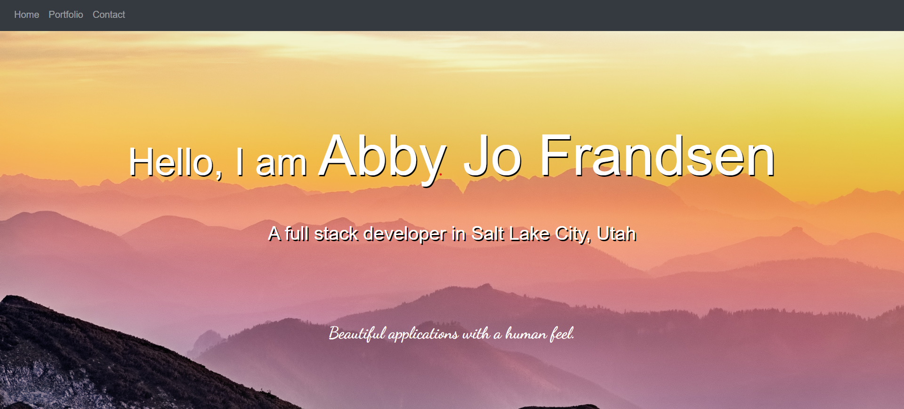
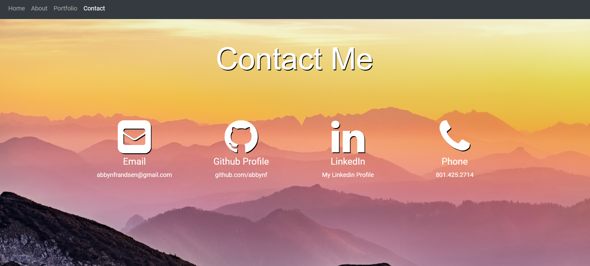

# abbynf.github.io
### My Portfolio

## Description
This application introduces my style, my projects, and how to contact me. The landing page showcases my dedication to simple but beatiful web pages that are responsive to different screen sizes. The "portfolio" page displays past projects with a short description. Github links and application links are available for each project for further perusal. The portfolio page will be updated regularly with new projects as I learn new skills. The "contact me" page has links to my github page, my LinkedIn, and my email address and phone number. 

Technologies used:
- HTML
- CSS
- Bootstrap

The application is accessible at https://abbynf.github.io/

Contact me at abbynfrandsen@gmail.com

## Credits
CSS library: [Bootstrap](https://getbootstrap.com/)
Background photo: [Simon Berger on Unsplash](https://unsplash.com/@8moments)
Contact icons: [Font Awesome](https://fontawesome.com/)
Fonts: [Google fonts](https://fonts.google.com/)

